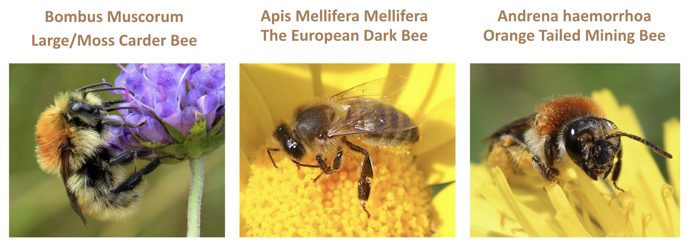

# Predicting Irish Bee Populations

Welcome scientists, politians, conservationists, concerned citizens, and beyond! For my fourth phase project in the Flatiron Data Science program, I have made a model that can help predict bee populations. 

In this project description, we will cover:

* [***Project Overview:***](#project-overview) The project goal, audience, and dataset
* [***Basic Walkthrough:***](#Walkthrough) The basics of what I did during the project
* [***Final Model***](#final_model) Final model chosen based on RSME and AIC
* [***Findings:***](#findings) Projected findings using said models
* [***Business Recommendations:***](#busrec) Recommendations based on model findings
* [***What's Next:***](#next) What I'd like to do to improve further

Before we get started, here are some links to navigate this project:
* [The notebook](https://github.com/evamizer/irish_bee_population_timeseries/blob/9fe4d7eb85467279982f4b3ed54af945cc241cd0/irish_bee_population_timeseries.ipynb)
* [The original dataset](https://www.gbif.org/dataset/6eed5110-c7b8-11de-b279-d063ea754e15)

## Project Overview

For this project, I used exploratory data analysis, data preparation, and modeling to generate insights for a business stakeholder.

### Business Problem

#### Stake Holders:
* Scientists, local politicians, and conservationists in Ireland looking to monitor and increase the bee population as needed.

#### Busniess Problem/Solution:
* Declining bee populations have been a problem worldwide, but especially in Ireland, where about 1/3 of the bee species face threat of extinction. Declining populations have a real impact on local ecosystems, as well as local and national economies, so monitoring and implementation of bee-friendly practices are needed.

* We want to take older data to get an idea of what we can expect to find for the current population of various species of bees, and make a plan based on those findings to increase bee populations.

*While these are over 100 species of bees in Ireland, we will be focusing on three - Bombus Muscorum, Apis Melliferas Melliferas, and Adrena Haemorrhoa.

### The Dataset

The [data](https://www.gbif.org/dataset/6eed5110-c7b8-11de-b279-d063ea754e15) we are using today is the dataset on the distribution of bees in Ireland from both published and unpublished sources spanning from 1884 to 2022, initially compiled as part of a Trinity College Dublin/Queen's University Belfast HEA funded research project on the conservation of Irish bees (2003-2006; Úna Fitzpatrick & Tomás Murray). It was used for conservation purposes, including the development of a Red List, which evaluates species on their extinction risk. It is now deposited with the National Biodiversity Data Centre and is managed by Úna Fitzpatrick.

#### Features Used:
* **eventDate:** Object, date of sighting
* **genus:** Object, genus of bee spotted
* **species:** Object, species of bee spotted

## Basic Walkthrough

* **Exploring the data**: Sizing up the data, planning what needs to be done.
* **Cleaning/Preprocesing the data**: No cleaning needed, so we made a subset of all entries between 2013-2015, then investigated further into genus and then species
* **Data Prep/Feature Engineering**: I checked for normality and homoscedasticity, implementing various ways to ready the data for time series modeling.
* **Models**: I tried out a couple different models (ARIMA*, SARIMAX*, and Prophet) after establishing a baseline naive model, adding in analysis for each one and trying out different ways to improve their results.
* **Final Model Selection**: Review the model I selected and explain why I chose it. 
* **Business Recommendations** - Implimentation and greater uses. 
* **Beyond**: Relfections on how I would improve my process or do something differently in the future. 

Note:

 "*"= Model was optimized with GridSearchCV after baseline established
 
## Final Model

After running a few models mentioned above, I chose Meta Prophet for each of the species studied. 

## Findings 

### Bombus Moscurom

Here we can plainly see it looks like the model is predicting a gradually lowering population. This is very troubling, but good to know.

### Apis Mellifera Mellifera

Here we can plainly see this model predicts an overall modest population increase.

### Adrena Haemorrhoa

Here we can see the model predicts a slight increase in Andrena bees, which is great news for the bees (and us).

## Business Recommendations 

**Basic Use Function**

When conducting newer surveys, you will be able to compare it to the predicted sightings of each species.

**Recommendation**

Should newer surveying result in a **higher** count than predicted or within the range predicted, I would reccommend the following:

* Conduct further analysis to see if various outside factors can account for the growth. See if population locations shifted/remained constant, if surveying efforts have changed or been expanded, and cross reference any past efforts (if any) had been made in relation to conservation.

Should newer surveying result in a **lower** count than predicted, I would reccommend the following:

### For Bombus Muscorum:

* Since this species is often found in urban areas, effort can be taken to increase the population of flowering plants within public spaces. On a private citizen level, the public could be encouraged to suppliment their gardens, window boxes, and green spaces with flowering plants.

* If there are sightings nearby each other, efforts should focused in the space between the two sightings to encourage connection.
When designing new urban spaces, care should be exhibited when developing the land as not to disturb any ground cavities that could host a nest.

### For Apis mellifera mellifera:

* Being a special case in that these bees can be both wild and kept for honey production and pollination, there should be more efforts put into expanding the Native Irish Honey Bee Society and their prospective projects to promote native beekeeping, breeding and producing strong colonies, and monitoring the health of the population, as well as spread awareness.
* When it comes to suspected wild mellifera sightings, if there are sightings relatively nearby each other, efforts should focused in the space between the two sightings to encourage connection.

### For Andrena :

* Plant more flowering spring plants along the short grass swards, especially along roads, trails, and trackways.

### For all species:
A common problem with the publics perception of bees is that they all sting and are dangerous, and they are often confused with other stinging bugs.

Public awareness campaigns should help educated the public on the varieties of bees in their locality and region, their needs, and their benefits. Raising awareness and giving a call to action to help make a more hospitible and symbiotic environment will help connect people who want to help with the know-how to do so.

In addtion, this public awareness might spur more citizens to join efforts in future surveys, especially if they know what they are seeing is important.

Lastly, more widespread efforts should be taken to create a more hospitible environment for wild bees that rely on pollen by rewilding underutilized or unused pastures, farmlands, and roadway shoulders with a focus on native plants attractive to most bees and plants attractive to specific species.

## What's Next
I would love to explore more into the locations that these sightings occured, and compare it to the species spotted and known characteristics that the species needs. I could see if any recent changes have happened that would affect the population (construction, local weather events, etc).

As we know, there is a huge difference between studying an organism in a contained environment, and a tiny one out flying about, so a few more things are needed to be considered when conducting surveys out in the feild like this.

Because of this, I would like to delve more into the process used to gather information on sightings both from this survey and current ones - from the actual process to evaluate a sighting, to the infrastructure of people involved, and their habits and involvement in the process. From that information, I would like to create a methodical plan to best coordinate volunteer efforts to ensure we are spreading out evenly enough to cover enough ground and avoid pitfalls such as volunteers being in close proximity of time and space when out spotting, or frequenting the same space repeatedly.

When it comes to working with the data itself, I would love to refine our Meta Prophet models more, and explore other models to see how they compare.

Lastly, thank you for taking the time to read through this, and I hope it helped inform and awaken your curiosity!

## Non-Technical Presentation
* [Here you will find my slideshow presentation](https://github.com/evamizer/irish_bee_population_timeseries/blob/9fe4d7eb85467279982f4b3ed54af945cc241cd0/bees_of_ireland.pdf)

 ## Repository Structure:

    ├── data
        └── bee_survey.csv
    ├── images
        └── andrena_predict.png
        └── apis_predict.png
        └── bees.png
        └── bombus_predict.png
     ├── .gitignore
     ├── README.md
     ├── bees_of_ireland.pdf
     └── irish_bee_population_timeseries.ipynb
